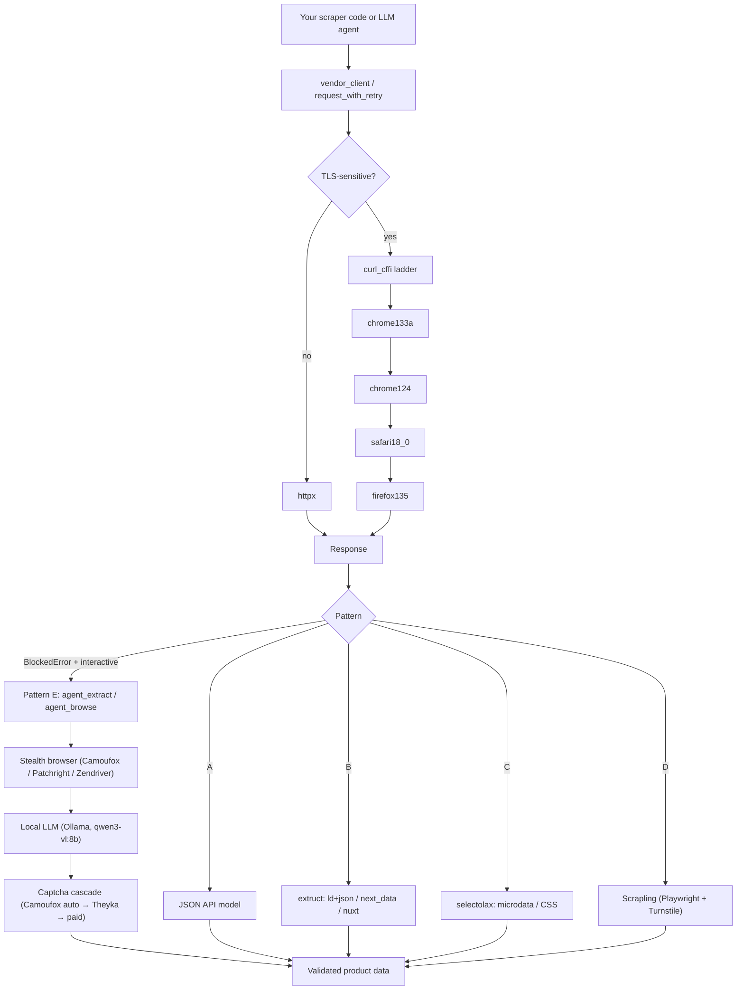

<div align="center">

# scrapper-tool

**A reusable Python web-scraping toolkit — production-grade primitives, anti-bot ladder, fixture-replay testing.**

Built from the scraping core behind [PartsPilot](https://github.com/ValeroK/affiliate-service), extracted as an open-source library so other projects (and LLM agents) can pick up the same patterns without redoing the reverse-engineering work.

<br />

[](https://github.com/ValeroK/scrapper-tool/actions/workflows/ci.yml)
[](https://pypi.org/project/scrapper-tool/)
[](https://pypi.org/project/scrapper-tool/)
[](https://pypi.org/project/scrapper-tool/)
[](LICENSE)
[](https://github.com/astral-sh/ruff)
[](https://mypy-lang.org/)
[](CONTRIBUTING.md)
[](https://github.com/ValeroK/scrapper-tool/stargazers)
[](https://github.com/ValeroK/scrapper-tool/network/members)

[**Quickstart**](#quickstart) · [**Settings**](docs/SETTINGS.md) · [**Pattern E (LLM agent)**](docs/patterns/e-llm-agent.md) · [**MCP integration**](docs/agent-integration.md) · [**Docker**](#run-with-docker) · [**Changelog**](CHANGELOG.md)

</div>

---

> **Status (2026-05-02):** stable (`v1.0.0`). The public Python API and MCP tool surface are SemVer-stable. `v0.1.0` covered the core pattern ladder, anti-bot helpers, and deterministic fixture-replay testing. `v0.2.0` added an MCP server for LLM agents. **`v1.0.0`** adds **Pattern E** — local-LLM-driven scraping for any protected site, via Camoufox + browser-use + Crawl4AI + Ollama (zero API cost), and graduates the project out of alpha. See [`docs/patterns/e-llm-agent.md`](docs/patterns/e-llm-agent.md).

## Table of contents

- [Why scrapper-tool](#why-scrapper-tool)
- [The five scraping patterns](#the-five-scraping-patterns)
- [Architecture](#architecture)
- [Install](#install)
- [Quickstart](#quickstart)
- [Run as an MCP server](#run-as-an-mcp-server)
- [Run as an HTTP REST sidecar](#run-as-an-http-rest-sidecar)
- [Run with Docker](#run-with-docker)
- [Settings](#settings)
- [Documentation](#documentation)
- [Why these tools?](#why-these-tools)
- [Roadmap](#roadmap)
- [Contributing](#contributing)
- [Contributors](#contributors)
- [Acknowledgements](#acknowledgements)
- [License](#license)

## Why scrapper-tool

Most scrapers are written from scratch every time, even though 90% of the work is the same: pick the right extraction pattern, survive the TLS fingerprint, retry/backoff sanely, and write tests that don't drift the moment a site updates.

`scrapper-tool` packages the parts that don't change per vendor, so you only write the parts that do.

- **Pattern-first design.** Five named, documented extraction patterns (A–E) — pick the one DevTools points at, skip the rest.
- **Anti-bot ladder built in.** Auto-walks `chrome133a → chrome124 → safari18_0 → firefox135` when a profile gets fingerprinted.
- **Deterministic tests.** Fixture-replay (`FakeCurlSession`, `replay_fixture`, golden snapshots) — no live HTTP in CI.
- **Optional hostile mode.** Cloudflare Turnstile / Akamai EVA defeat path via [Scrapling](https://github.com/D4Vinci/Scrapling) — opt-in extra, no Playwright bloat by default.
- **LLM-agent ready.** `v0.2.0+` ships an MCP server so Claude, AutoGen, LangChain, etc. can drive the scraper directly.
- **Local-LLM scraping for any protected site (`v1.0.0+`).** Pattern E adds Camoufox + browser-use + Crawl4AI + Ollama — zero API cost, two modes (`agent_extract` for fast 1-call extraction, `agent_browse` for interactive multi-step tasks). Auto-cascade captcha solver (Camoufox auto-pass → Theyka → optional paid). Humanlike-behavior layer defeats DataDome.
- **Boring stack.** `httpx`, `curl_cffi`, `selectolax`, `extruct`. No managed SaaS bundled — your code, your egress.

## The five scraping patterns

Web scraping in 2026 is dominated by five recurring patterns. This lib gives each pattern a documented helper plus the surrounding infrastructure (HTTP client with TLS-impersonation fallback, retry/backoff, fixture-replay testing) so you don't reinvent them per vendor.

| Pattern | When to use | Helper | Cost |
|---|---|---|---|
| **A — JSON API** | DevTools shows an XHR returning the price-bearing JSON. Anonymous or OAuth. | `vendor_client()` + your own response model | Lowest — parse, validate, done. |
| **B — Embedded JSON** | Document HTML carries `<script type="application/ld+json">`, `__NEXT_DATA__`, `__NUXT__`, or `self.__next_f.push(...)`. | `patterns.b.extract_product_offer()` (via [`extruct`](https://github.com/scrapinghub/extruct)) | Low — one call, broad markup coverage. |
| **C — CSS / microdata** | Price visible in HTML, no embedded JSON. Prefer `itemprop="price"` schema.org microdata. | `patterns.c.extract_microdata_price()` (via [`selectolax`](https://github.com/rushter/selectolax)) | Medium — selectors break on ancestor reshuffles. |
| **D — Hostile** | Cloudflare Turnstile, Akamai EVA, etc. defeat both default `httpx` and `curl_cffi`. | `patterns.d.hostile_client()` (via [Scrapling](https://github.com/D4Vinci/Scrapling)) — `pip install scrapper-tool[hostile]` | High — Playwright runtime, ≈400 MB image bloat. |
| **E — LLM agent** *(v1.0.0+)* | Pattern D still gets blocked, OR the page needs interaction (login, multi-step nav, dynamic forms), OR there's no stable selector. | `agent_extract()` (Crawl4AI + Ollama) and `agent_browse()` (browser-use + Camoufox + Ollama) — `pip install scrapper-tool[llm-agent]` | Highest — local-LLM latency. Free at run-time (no API). See [Pattern E docs](docs/patterns/e-llm-agent.md). |

Plus a four-profile **anti-bot ladder** (`chrome133a → chrome124 → safari18_0 → firefox135`) that auto-walks when a profile gets fingerprinted, and a `scrapper-tool canary` CLI for nightly fingerprint-health probes.

## Architecture



## Install

**Recommended — all five patterns in one install** (uv):

```bash
uv pip install scrapper-tool[full,agent]    # Pattern A/B/C/D/E + MCP server
camoufox fetch                              # ~300 MB — best-stealth Firefox (Pattern E)
patchright install chromium                 # ~250 MB — fast-mode Chromium (Pattern E)
ollama pull qwen3-vl:8b                     # default model (16 GB VRAM); use qwen3-vl:4b on 8 GB
```

`[full]` bundles `[hostile]` + `[llm-agent]` + `[turnstile-solver]` so every
pattern works in one environment. It's **uv-only** because Scrapling pins
`lxml>=6` and Crawl4AI pins `lxml~=5.3`, and only uv honors the
`[tool.uv] override-dependencies = ["lxml>=6.0.3"]` declared in
`pyproject.toml`. The override is safe — both libraries use the stable
`lxml.html`/XPath surface that's compatible across lxml 5/6.

### À la carte (when you don't need everything)

```bash
pip install scrapper-tool                   # core: httpx + curl_cffi + selectolax + extruct
pip install scrapper-tool[agent]            # adds the MCP server
pip install scrapper-tool[hostile]          # Pattern D — Scrapling
pip install scrapper-tool[llm-agent]        # Pattern E — Camoufox + browser-use + Crawl4AI + Ollama
```

`[hostile]` and `[llm-agent]` are **mutually exclusive under plain `pip`**
(lxml conflict). For both in one env, use `uv pip install scrapper-tool[full,agent]`
above, or pip with a constraints file pinning `lxml>=6.0.3`.

## Quickstart

```python
import asyncio
from scrapper_tool import vendor_client, request_with_retry
from scrapper_tool.patterns.b import extract_product_offer

async def main() -> None:
    async with vendor_client() as client:
        resp = await request_with_retry(client, "GET", "https://example-shop.test/product/123")
        product = extract_product_offer(resp.text, base_url=str(resp.url))
        print(product)

asyncio.run(main())
```

For TLS-sensitive vendors, flip one switch:

```python
async with vendor_client(use_curl_cffi=True) as client:
    ...   # walks chrome133a → chrome124 → safari → firefox until one returns 200
```

For protected sites (Cloudflare, DataDome, Akamai) where Pattern D fails, escalate to Pattern E:

```python
import asyncio
from scrapper_tool.agent import agent_extract, agent_browse

# E1 — fast extraction-after-render. 1 LLM call, default for "scrape this data".
result = asyncio.run(
    agent_extract(
        "https://quotes.toscrape.com/",
        schema={
            "type": "object",
            "properties": {
                "quotes": {
                    "type": "array",
                    "items": {
                        "type": "object",
                        "properties": {
                            "text": {"type": "string"},
                            "author": {"type": "string"},
                        },
                    },
                }
            },
        },
    )
)
print(result.data)

# E2 — multi-step interactive task (login, paginate, fill forms).
result = asyncio.run(
    agent_browse(
        "https://example.com/login",
        instruction="Log in with username 'demo' and password 'demo123', "
                    "then return the user's email shown on the dashboard.",
    )
)
```

See **[`docs/quickstart.md`](docs/quickstart.md)** for a 5-minute on-ramp covering all five patterns and **[`docs/patterns/e-llm-agent.md`](docs/patterns/e-llm-agent.md)** for Pattern E specifics (when to use which mode, hardware sizing, captcha cascade, ToS notes).

## Run as an MCP server

`scrapper-tool` ships an MCP server that exposes every pattern as a tool any
MCP-aware client (Claude Desktop, Claude Code, OpenClaw, Hermes Agent, AutoGen,
LangChain) can call.

### Tools exposed

| Tool | Purpose |
|------|---------|
| `auto_scrape(url, schema_json, instruction, model, browser, timeout_s)` *(v1.1.0+)* | **Recommended first tool.** Auto-escalating ladder A/B/C → E1 → E2 in a single call. Returns `pattern_used`. |
| `fetch_with_ladder(url, method, use_curl_cffi, extract_structured)` | HTTP fetch through the TLS-impersonation ladder. With `extract_structured=True` (v1.1.0+) also runs Pattern B + C. |
| `extract_product(html, base_url)` | Pattern B — schema.org Product+Offer parser. |
| `extract_microdata_price(html)` | Pattern C — `<meta itemprop="price">` parser. |
| `canary(url, profiles)` | Walk the impersonation ladder and report which profile won. |
| `agent_extract(url, schema_json, instruction, model, browser, headful, timeout_s)` | **Pattern E1** — render with a stealth browser, 1 LLM call to extract structured JSON. Requires `[llm-agent]` extra. |
| `agent_browse(url, instruction, schema_json, model, browser, max_steps, headful, timeout_s)` | **Pattern E2** — multi-step browser-use agent loop for interactive tasks. Requires `[llm-agent]` extra. |

### How it runs

The server speaks three transports — pick the one your client supports:

| Transport | Used by | How |
|-----------|---------|-----|
| **stdio** *(default)* | Claude Desktop, Claude Code (local) | Client spawns `scrapper-tool-mcp` as a subprocess; JSON-RPC over stdin/stdout. |
| **streamable-http** | Cursor, Claude Code (remote), mcp-use, any 2026 MCP-aware app | Long-running service; client connects via `url:` config. |
| **sse** | Older clients still on Server-Sent Events | Same as streamable-http but at `/sse`. |

```bash
pip install scrapper-tool[agent]            # MCP only
pip install scrapper-tool[agent,llm-agent]  # MCP + Pattern E

scrapper-tool-mcp                           # stdio (default)
scrapper-tool-mcp --transport streamable-http --host 0.0.0.0 --port 8765
scrapper-tool-mcp --help                    # full flag reference
```

Or via Docker (recommended — bundles all five patterns):

```bash
# HTTP service on host port 8765 — ready for Cursor / Claude Code / mcp-use:
SCRAPPER_TOOL_MCP_PORT=8765 \
SCRAPPER_TOOL_AGENT_LLM=openai_compat \
SCRAPPER_TOOL_AGENT_OLLAMA_URL=http://host.docker.internal:1234 \
SCRAPPER_TOOL_AGENT_MODEL=qwen3-vl-8b-instruct \
docker compose --profile http up -d scrapper-tool-mcp-http
```

### Wire into Claude Code / Cursor / Claude Desktop

#### Recommended — point at the Docker HTTP service

Once `docker compose --profile http up -d scrapper-tool-mcp-http` is running,
any URL-aware MCP client connects with one line:

```jsonc
// Cursor — Settings → MCP → Add Server, OR ~/.cursor/mcp.json
{
  "mcpServers": {
    "scrapper-tool": {
      "url": "http://localhost:8765/mcp",
      "type": "http"
    }
  }
}

// Claude Code — .mcp.json (project) or claude_desktop_config.json (global)
{
  "mcpServers": {
    "scrapper-tool": {
      "url": "http://localhost:8765/mcp"
    }
  }
}
```

This is the production shape: one warm container, many concurrent agents,
clean URL config, no per-call cold-start. Restart-as-a-service via
`docker compose --profile http restart scrapper-tool-mcp-http`.

#### Local-binary stdio (Claude Desktop pattern)

If your client only supports the spawn-a-binary pattern:

```json
{
  "mcpServers": {
    "scrapper-tool": {
      "command": "scrapper-tool-mcp",
      "args": [],
      "env": {
        "SCRAPPER_TOOL_AGENT_BROWSER": "patchright",
        "SCRAPPER_TOOL_AGENT_MODEL": "qwen3-vl:8b",
        "SCRAPPER_TOOL_AGENT_OLLAMA_URL": "http://localhost:11434"
      }
    }
  }
}
```

Or spawn the Docker container per call (Pattern E works on Windows hosts this
way because the agent runs Linux-side):

```json
{
  "mcpServers": {
    "scrapper-tool": {
      "command": "docker",
      "args": [
        "compose", "-f", "/abs/path/to/scrapper-tool/docker-compose.yml",
        "run", "--rm", "-T", "scrapper-tool"
      ]
    }
  }
}
```

For framework-specific wiring (AutoGen, LangChain, mcp-use, OpenClaw, Hermes
Agent), see **[`docs/agent-integration.md`](docs/agent-integration.md)**.

## Run as an HTTP REST sidecar

> Available since **v1.1.0**.

When the consumer is a service (not an LLM agent) — for example the affiliate
service, a Node/Go backend, or a Python worker that already speaks HTTP —
spawn the **REST sidecar** on port **5792**:

```bash
pip install 'scrapper-tool[http]'
scrapper-tool-serve
```

Or via Docker (bundles all five patterns):

```bash
docker compose --profile rest up -d scrapper-tool-rest
curl http://localhost:5792/health    # {"status": "ok"}
```

The primary endpoint is **`POST /scrape`** — it runs the full A/B/C → E1 → E2
escalation ladder server-side so callers don't need per-pattern decision logic:

```bash
curl -s -X POST http://localhost:5792/scrape \
  -H "Content-Type: application/json" \
  -d '{"url":"https://example.com/product/123"}'
```

| Endpoint | Purpose |
|---|---|
| `POST /scrape` | **Primary.** Auto-escalating ladder A/B/C → E1 → E2. Returns `pattern_used`. |
| `POST /fetch` | Pattern A/B/C with optional Pattern B/C structured extraction. |
| `POST /extract` | Pattern E1 direct (Crawl4AI + LLM, 1 call). |
| `POST /browse` | Pattern E2 direct (browser-use multi-step agent). |
| `GET /health` | Liveness probe — always 200. |
| `GET /ready` | Readiness with detailed component checks (Ollama, model, browser). |
| `GET /version` | Version + installed-extras info. |
| `GET /docs` | Swagger UI. |
| `GET /openapi.json` | Raw OpenAPI 3.1 spec — for typed-client codegen. |

Optional `X-API-Key` auth via `SCRAPPER_TOOL_HTTP_API_KEY`. Full reference and
examples in **[`docs/http-sidecar.md`](docs/http-sidecar.md)**; static OpenAPI
spec at [`docs/openapi/openapi.yaml`](docs/openapi/openapi.yaml) for
generating typed clients (Python via `openapi-python-client`, TypeScript via
`openapi-typescript-codegen`).

## Run with Docker

The repository ships **one** image — `Dockerfile` — that bundles **all five
patterns** (A/B/C/D/E + MCP server): Scrapling, Camoufox-ready, Patchright,
Crawl4AI, browser-use, captcha solvers. Built on the `[full]` extra.

The image **does NOT bundle an LLM**. You bring your own — Ollama, LM Studio,
llama.cpp, vLLM — running on the host (or a remote server) and the container
talks to it over `host.docker.internal` (Mac/Windows Docker Desktop maps this
natively; on Linux the compose file declares `extra_hosts`).

### One-liner — assuming Ollama on host

```bash
ollama pull qwen3-vl:8b                           # one-time on the host
docker compose run --rm scrapper-tool python -c "
import asyncio
from scrapper_tool.agent import agent_extract
print(asyncio.run(agent_extract(
    'https://quotes.toscrape.com/',
    schema={'type':'object','properties':{'quotes':{'type':'array'}}},
)))
"
```

The container resolves `SCRAPPER_TOOL_AGENT_OLLAMA_URL=http://host.docker.internal:11434`
by default. Override in `.env` or environment to point elsewhere — see the
[external LLM section below](#external-llms-lm-studio-llamacpp-vllm-remote-ollama).

### What's in the image

| Capability | Status |
|------------|--------|
| Pattern A (JSON API), B (embedded JSON), C (CSS / microdata) | ✅ always |
| Pattern D (Scrapling hostile-site fetcher) | ✅ pre-installed |
| Pattern E1 (`agent_extract`) | ✅ pre-installed |
| Pattern E2 (`agent_browse`) | ✅ pre-installed |
| Browser: Patchright (Pattern E "fast mode") | ✅ pre-installed |
| Browser: Playwright Chromium (Pattern D Scrapling) | ✅ pre-installed |
| Browser: Camoufox (Pattern E best-stealth) | optional via `--build-arg INSTALL_CAMOUFOX=1` (+300 MB) |
| Browser: Zendriver / Botasaurus | rebuild with the matching `--extra ...-backend` |
| LLM: external Ollama / LM Studio / llama.cpp / vLLM | ✅ via `host.docker.internal` (see below). The image does NOT bundle an LLM. |
| Captcha Tier 0 (Camoufox auto-pass) | ✅ when `INSTALL_CAMOUFOX=1` |
| Captcha Tier 1 (Theyka) | ✅ pre-installed |
| Captcha Tier 2 (CapSolver / NopeCHA / 2Captcha) | ✅ via env key |
| MCP server (stdio JSON-RPC) | ✅ default entrypoint |
| Canary CLI (`scrapper-tool`) | ✅ |

#### Why this works — the `[full]` extra and the lxml override

Scrapling pins `lxml>=6.0.3` and Crawl4AI pins `lxml~=5.3`. These are
**conservative pins**, not real API breakage — both libraries use the stable
`lxml.html` / XPath surface that's compatible across lxml 5/6.
`pyproject.toml` declares `[tool.uv] override-dependencies = ["lxml>=6.0.3"]`,
which forces a single resolved lxml across both packages. Verified in CI:
238 tests pass with both extras installed simultaneously.

If you prefer plain pip (which doesn't honor `[tool.uv]` overrides), use uv
instead, or pass `pip install --constraint constraints.txt scrapper-tool[full]`
with `lxml>=6.0.3` in `constraints.txt`.

### Pull the published image

Tagged releases are published to GitHub Container Registry. Pull the latest:

```bash
docker pull ghcr.io/valerok/scrapper-tool:latest
# or pin to a specific version
docker pull ghcr.io/valerok/scrapper-tool:1.0.0
```

Tags published per release: `<major>.<minor>.<patch>`, `<major>.<minor>`, and
`latest` (only on non-prerelease tags).

### Build options (local / fork)

```bash
# All five patterns in one image (~1.6 GB).
docker build -t scrapper-tool .
# Or via compose: docker compose build scrapper-tool

# Plus Camoufox baked in (~+300 MB; highest-stealth backend).
docker build --build-arg INSTALL_CAMOUFOX=1 -t scrapper-tool:camoufox .
```

### External LLMs (LM Studio, llama.cpp, vLLM, remote Ollama)

The image talks to whichever LLM server you run, on the host or remotely.
Set the right `SCRAPPER_TOOL_AGENT_*` env vars in your `.env` next to
`docker-compose.yml`:

| Server | `SCRAPPER_TOOL_AGENT_LLM` | `SCRAPPER_TOOL_AGENT_OLLAMA_URL` |
|--------|---------------------------|----------------------------------|
| Ollama on host (default) | `ollama` | `http://host.docker.internal:11434` |
| LM Studio on host | `openai_compat` | `http://host.docker.internal:1234` |
| llama.cpp `server` on host | `llama_cpp` | `http://host.docker.internal:8080` |
| vLLM on host | `vllm` | `http://host.docker.internal:8000` |
| Remote Ollama / OpenAI-compat | `ollama` / `openai_compat` | `https://my-llm.example/v1` etc. |

LM Studio example:

1. LM Studio → Developer / Local Server tab → Start Server (port 1234 by default).
2. Note the model name shown there (e.g. `qwen3-vl-8b-instruct`).
3. `.env`:
   ```env
   SCRAPPER_TOOL_AGENT_LLM=openai_compat
   SCRAPPER_TOOL_AGENT_OLLAMA_URL=http://host.docker.internal:1234
   SCRAPPER_TOOL_AGENT_MODEL=qwen3-vl-8b-instruct
   ```
4. `docker compose run --rm -T scrapper-tool`.

The compose file already declares `extra_hosts: ["host.docker.internal:host-gateway"]`
so `host.docker.internal` resolves on Linux too (Mac/Windows Docker Desktop
maps it natively).

### Run as MCP server in Docker

The image's default entrypoint is `scrapper-tool-mcp` (stdio MCP server). Wire
your MCP client to invoke `docker compose run --rm -T scrapper-tool` and you're
done — see the JSON example above. The `-T` flag keeps stdio attached cleanly.

### Live integration tests inside Docker

```bash
docker compose --profile live up canary    # runs tests/integration/test_agent_live.py
```

## Settings

`scrapper-tool` is configured via `SCRAPPER_TOOL_*` environment variables, an
`AgentConfig` Python object, or per-call kwargs.

**Resolution order (highest first):** explicit kwargs → `config=AgentConfig(...)`
→ env vars → built-in defaults.

### Where do settings go when used as a library?

You have three valid places to put them. Pick whichever fits your deployment.

**Option A — env vars in your shell or process manager** (simplest, deployment-friendly):

```bash
export SCRAPPER_TOOL_AGENT_BROWSER=patchright
export SCRAPPER_TOOL_AGENT_MODEL=qwen3-vl:8b
export SCRAPPER_TOOL_CAPTCHA_KEY=sk_capsolver_xxx
python my_scraper.py
```

In Python, just call `AgentConfig.from_env()` (or use the bare functions —
they do this automatically when you don't pass `config=`):

```python
from scrapper_tool.agent import agent_extract

# Reads SCRAPPER_TOOL_* env at call time. No setup needed.
result = await agent_extract("https://example.com", schema={"type": "object"})
```

**Option B — a `.env` file loaded by your app** (great for local dev):

`scrapper-tool` itself does **not** auto-load `.env`. Either let your runner
do it (`uv run --env-file .env python my_scraper.py`, `docker compose`, or
your process manager), or load it explicitly in your entry point with
[`python-dotenv`](https://pypi.org/project/python-dotenv/):

```python
# my_scraper.py
from dotenv import load_dotenv
load_dotenv()                      # MUST be called BEFORE importing scrapper_tool

import asyncio
from scrapper_tool.agent import agent_extract

result = asyncio.run(
    agent_extract("https://example.com", schema={"type": "object"})
)
```

Copy [`.env.example`](.env.example) → `.env` and edit. The example file
documents every supported variable with safe defaults.

**Option C — pass an `AgentConfig` in code** (most explicit, ideal for tests):

```python
from scrapper_tool.agent import AgentConfig, agent_extract, agent_session
from pydantic import SecretStr

cfg = AgentConfig(
    browser="patchright",
    model="qwen3-vl:8b",
    ollama_url="http://localhost:11434",
    behavior="humanlike",
    captcha_solver="auto",
    captcha_api_key=SecretStr("sk_capsolver_xxx"),
    timeout_s=180,
)

# Per-call:
result = await agent_extract(url, schema=..., config=cfg)

# Or hold a session for many calls (warm browser + LLM context):
async with agent_session(config=cfg) as s:
    a = await s.extract(url_a, schema=...)
    b = await s.browse(url_b, "log in and ...")
```

**Per-call overrides** layer on top of any of the above:

```python
# cfg.model is "qwen3-vl:8b" but THIS call uses qwen3-coder:30b.
result = await agent_extract(url, schema=..., config=cfg, model="qwen3-coder:30b")
```

### Reference

- **[`docs/SETTINGS.md`](docs/SETTINGS.md)** — every variable, default, choice
  list, and recommendation.
- **[`.env.example`](.env.example)** — drop-in starter file with every documented
  variable annotated.

## Documentation

| | |
|---|---|
| **[Quickstart](docs/quickstart.md)** | 5-minute on-ramp. |
| **[Settings reference](docs/SETTINGS.md)** | Every env var, default, choice list. *(v1.0.0+)* |
| **[`.env.example`](.env.example)** | Drop-in starter file with every variable annotated. |
| **[E2E test plan](docs/E2E_TEST_PLAN.md)** | Operator-runnable end-to-end suite — library / Docker / MCP modes against LM Studio. *(v1.0.0+)* |
| **[`scripts/e2e/`](scripts/e2e/)** | Runnable test scripts referenced by the E2E plan. |
| **[Recon playbook](docs/recon.md)** | DevTools-driven reverse-engineering of a new vendor site. |
| **[Pattern A — JSON API](docs/patterns/a-json-api.md)** | Vendor exposes an XHR / JSON endpoint. |
| **[Pattern B — Embedded JSON](docs/patterns/b-embedded-json.md)** | `ld+json`, `__NEXT_DATA__`, `__NUXT__`, RSC payloads. |
| **[Pattern C — CSS / microdata](docs/patterns/c-css-microdata.md)** | `itemprop="price"`, fallback selectors. |
| **[Pattern D — Hostile](docs/patterns/d-hostile.md)** | Cloudflare Turnstile, Akamai EVA. |
| **[Pattern E — LLM agent](docs/patterns/e-llm-agent.md)** | Local-LLM-driven scraping for any protected site. *(v1.0.0+)* |
| **[Anti-bot ladder reference](docs/reference/ladder.md)** | How the ladder walks, when to bump the primary profile. |
| **[Test helpers](docs/reference/testing.md)** | `FakeCurlSession`, `replay_fixture`, golden-snapshot pattern. |
| **[Agent integration](docs/agent-integration.md)** | MCP wiring for Claude, OpenClaw, Hermes Agent, AutoGen, LangChain. *(v0.2.0+)* |
| **[2026-04-30 landscape research](docs/research/2026-04-30-landscape.md)** | Why these tools, sourced. |

## Why these tools?

Short version: `curl_cffi` is the only actively-maintained TLS-impersonation lib with `chrome131+`/`chrome133a`/`chrome142`/`chrome146` profiles; `puppeteer-stealth` and `playwright-extra` were deprecated in 2025-02; Scrapling is the only OSS Playwright-based stack with a working Turnstile auto-solve as of 2026; managed SaaS (Firecrawl, ZenRows, Bright Data) is deliberately not bundled.

Full sourced rationale: **[`docs/research/2026-04-30-landscape.md`](docs/research/2026-04-30-landscape.md)**.

## Roadmap

- [x] **v0.1.0** — Core HTTP client, retry/backoff, anti-bot ladder, patterns A–D, fixture-replay test helpers.
- [x] **v0.2.0** — MCP server for LLM agents; canary CLI for nightly fingerprint-health probes.
- [x] **v1.0.0** — Pattern E: local-LLM-driven scraping (Camoufox + browser-use + Crawl4AI + Ollama), captcha cascade, humanlike-behavior layer, full Docker stack. Public API + MCP tool surface stable under SemVer.
- [ ] **v1.1.0** — Pluggable rate-limit / robots.txt policies; per-vendor profile presets; `agent_session()` warm-browser pooling; broader Pattern E backends.

See [`CHANGELOG.md`](CHANGELOG.md) for landed changes and [open issues](https://github.com/ValeroK/scrapper-tool/issues) for what's in flight.

## Contributing

PRs and issues are welcome. Every PR that meaningfully changes how we scrape lands a `CHANGELOG.md` row.

- Read **[`CONTRIBUTING.md`](CONTRIBUTING.md)** for the maintenance contract.
- Read **[`CODE_OF_CONDUCT.md`](CODE_OF_CONDUCT.md)** before opening a discussion.
- Good first issues live under the [`good first issue`](https://github.com/ValeroK/scrapper-tool/labels/good%20first%20issue) label.

## Contributors

<a href="https://github.com/ValeroK/scrapper-tool/graphs/contributors">
  
</a>

Want to see your avatar here? Check [CONTRIBUTING.md](CONTRIBUTING.md) and open a PR.

## Acknowledgements

`scrapper-tool` stands on the shoulders of these projects:

- [`httpx`](https://github.com/encode/httpx) — async HTTP client
- [`curl_cffi`](https://github.com/lexiforest/curl_cffi) — TLS / JA3 impersonation
- [`selectolax`](https://github.com/rushter/selectolax) — fast HTML parsing
- [`extruct`](https://github.com/scrapinghub/extruct) — `ld+json`, microdata, RDFa extraction
- [`Scrapling`](https://github.com/D4Vinci/Scrapling) — Playwright-based hostile-site backend

## License

[MIT](LICENSE) © scrapper-tool contributors.

<div align="center">

If `scrapper-tool` saves you time, consider [starring the repo](https://github.com/ValeroK/scrapper-tool) — it helps others find it.

</div>
