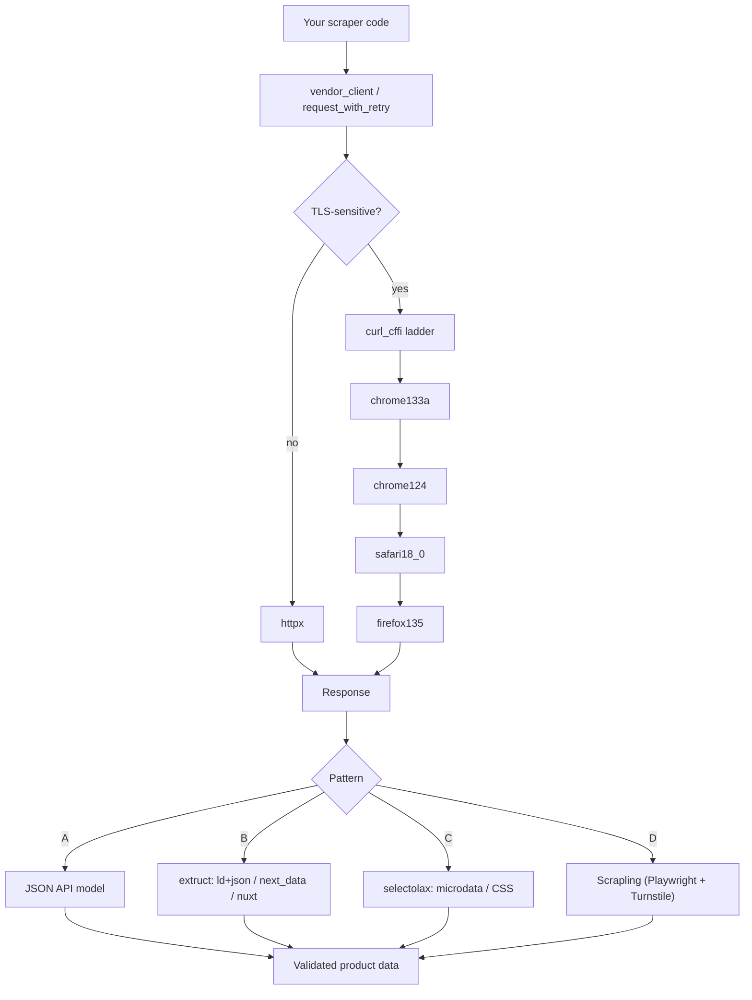

<div align="center">

# scrapper-tool

**A reusable Python web-scraping toolkit — production-grade primitives, anti-bot ladder, fixture-replay testing.**

Built from the scraping core behind [PartsPilot](https://github.com/ValeroK/affiliate-service), extracted as an open-source library so other projects (and LLM agents) can pick up the same patterns without redoing the reverse-engineering work.

<br />

[](https://github.com/ValeroK/scrapper-tool/actions/workflows/ci.yml)
[](https://pypi.org/project/scrapper-tool/)
[](https://pypi.org/project/scrapper-tool/)
[](https://pypi.org/project/scrapper-tool/)
[](LICENSE)
[](https://github.com/astral-sh/ruff)
[](https://mypy-lang.org/)
[](CONTRIBUTING.md)
[](https://github.com/ValeroK/scrapper-tool/stargazers)
[](https://github.com/ValeroK/scrapper-tool/network/members)

[**Quickstart**](#quickstart) · [**Documentation**](docs/index.md) · [**Recon playbook**](docs/recon.md) · [**Changelog**](CHANGELOG.md) · [**Contributing**](CONTRIBUTING.md)

</div>

---

> **Status (2026-04-30):** alpha. `v0.1.0` covers the core pattern ladder, anti-bot helpers, and deterministic fixture-replay testing. `v0.2.0` adds an MCP server for LLM agents (Claude, OpenClaw, Hermes Agent, AutoGen, LangChain).

## Table of contents

- [Why scrapper-tool](#why-scrapper-tool)
- [The four scraping patterns](#the-four-scraping-patterns)
- [Architecture](#architecture)
- [Install](#install)
- [Quickstart](#quickstart)
- [Documentation](#documentation)
- [Why these tools?](#why-these-tools)
- [Roadmap](#roadmap)
- [Contributing](#contributing)
- [Contributors](#contributors)
- [Acknowledgements](#acknowledgements)
- [License](#license)

## Why scrapper-tool

Most scrapers are written from scratch every time, even though 90% of the work is the same: pick the right extraction pattern, survive the TLS fingerprint, retry/backoff sanely, and write tests that don't drift the moment a site updates.

`scrapper-tool` packages the parts that don't change per vendor, so you only write the parts that do.

- **Pattern-first design.** Four named, documented extraction patterns (A–D) — pick the one DevTools points at, skip the rest.
- **Anti-bot ladder built in.** Auto-walks `chrome133a → chrome124 → safari18_0 → firefox135` when a profile gets fingerprinted.
- **Deterministic tests.** Fixture-replay (`FakeCurlSession`, `replay_fixture`, golden snapshots) — no live HTTP in CI.
- **Optional hostile mode.** Cloudflare Turnstile / Akamai EVA defeat path via [Scrapling](https://github.com/D4Vinci/Scrapling) — opt-in extra, no Playwright bloat by default.
- **LLM-agent ready.** `v0.2.0+` ships an MCP server so Claude, AutoGen, LangChain, etc. can drive the scraper directly.
- **Boring stack.** `httpx`, `curl_cffi`, `selectolax`, `extruct`. No managed SaaS bundled — your code, your egress.

## The four scraping patterns

Web scraping in 2026 is dominated by four recurring patterns. This lib gives each pattern a documented helper plus the surrounding infrastructure (HTTP client with TLS-impersonation fallback, retry/backoff, fixture-replay testing) so you don't reinvent them per vendor.

| Pattern | When to use | Helper | Cost |
|---|---|---|---|
| **A — JSON API** | DevTools shows an XHR returning the price-bearing JSON. Anonymous or OAuth. | `vendor_client()` + your own response model | Lowest — parse, validate, done. |
| **B — Embedded JSON** | Document HTML carries `<script type="application/ld+json">`, `__NEXT_DATA__`, `__NUXT__`, or `self.__next_f.push(...)`. | `patterns.b.extract_product_offer()` (via [`extruct`](https://github.com/scrapinghub/extruct)) | Low — one call, broad markup coverage. |
| **C — CSS / microdata** | Price visible in HTML, no embedded JSON. Prefer `itemprop="price"` schema.org microdata. | `patterns.c.extract_microdata_price()` (via [`selectolax`](https://github.com/rushter/selectolax)) | Medium — selectors break on ancestor reshuffles. |
| **D — Hostile** | Cloudflare Turnstile, Akamai EVA, etc. defeat both default `httpx` and `curl_cffi`. | `patterns.d.hostile_client()` (via [Scrapling](https://github.com/D4Vinci/Scrapling)) — `pip install scrapper-tool[hostile]` | Highest — Playwright runtime, ≈400 MB image bloat. |

Plus a four-profile **anti-bot ladder** (`chrome133a → chrome124 → safari18_0 → firefox135`) that auto-walks when a profile gets fingerprinted, and a `scrapper-tool canary` CLI for nightly fingerprint-health probes.

## Architecture



## Install

```bash
pip install scrapper-tool                # core: httpx + curl_cffi + selectolax + extruct
pip install scrapper-tool[hostile]       # adds Scrapling for Cloudflare Turnstile
pip install scrapper-tool[agent]         # adds the MCP server (v0.2.0+) for LLM agents
```

> **Tip.** The `[hostile]` extra pulls Playwright (~400 MB). Don't install it unless you actually need pattern D.

## Quickstart

```python
import asyncio
from scrapper_tool import vendor_client, request_with_retry
from scrapper_tool.patterns.b import extract_product_offer

async def main() -> None:
    async with vendor_client() as client:
        resp = await request_with_retry(client, "GET", "https://example-shop.test/product/123")
        product = extract_product_offer(resp.text, base_url=str(resp.url))
        print(product)

asyncio.run(main())
```

For TLS-sensitive vendors, flip one switch:

```python
async with vendor_client(use_curl_cffi=True) as client:
    ...   # walks chrome133a → chrome124 → safari → firefox until one returns 200
```

See **[`docs/quickstart.md`](docs/quickstart.md)** for a 5-minute on-ramp covering all four patterns.

## Documentation

| | |
|---|---|
| **[Quickstart](docs/quickstart.md)** | 5-minute on-ramp. |
| **[Recon playbook](docs/recon.md)** | DevTools-driven reverse-engineering of a new vendor site. |
| **[Pattern A — JSON API](docs/patterns/a-json-api.md)** | Vendor exposes an XHR / JSON endpoint. |
| **[Pattern B — Embedded JSON](docs/patterns/b-embedded-json.md)** | `ld+json`, `__NEXT_DATA__`, `__NUXT__`, RSC payloads. |
| **[Pattern C — CSS / microdata](docs/patterns/c-css-microdata.md)** | `itemprop="price"`, fallback selectors. |
| **[Pattern D — Hostile](docs/patterns/d-hostile.md)** | Cloudflare Turnstile, Akamai EVA. |
| **[Anti-bot ladder reference](docs/reference/ladder.md)** | How the ladder walks, when to bump the primary profile. |
| **[Test helpers](docs/reference/testing.md)** | `FakeCurlSession`, `replay_fixture`, golden-snapshot pattern. |
| **[Agent integration](docs/agent-integration.md)** | MCP wiring for Claude, OpenClaw, Hermes Agent, AutoGen, LangChain. *(v0.2.0+)* |
| **[2026-04-30 landscape research](docs/research/2026-04-30-landscape.md)** | Why these tools, sourced. |

## Why these tools?

Short version: `curl_cffi` is the only actively-maintained TLS-impersonation lib with `chrome131+`/`chrome133a`/`chrome142`/`chrome146` profiles; `puppeteer-stealth` and `playwright-extra` were deprecated in 2025-02; Scrapling is the only OSS Playwright-based stack with a working Turnstile auto-solve as of 2026; managed SaaS (Firecrawl, ZenRows, Bright Data) is deliberately not bundled.

Full sourced rationale: **[`docs/research/2026-04-30-landscape.md`](docs/research/2026-04-30-landscape.md)**.

## Roadmap

- [x] **v0.1.0** — Core HTTP client, retry/backoff, anti-bot ladder, patterns A–D, fixture-replay test helpers.
- [ ] **v0.2.0** — MCP server for LLM agents; canary CLI for nightly fingerprint-health probes.
- [ ] **v0.3.0** — Pluggable rate-limit / robots.txt policies; per-vendor profile presets.
- [ ] **v1.0.0** — API stability guarantee; broader pattern-D backends.

See [`CHANGELOG.md`](CHANGELOG.md) for landed changes and [open issues](https://github.com/ValeroK/scrapper-tool/issues) for what's in flight.

## Contributing

PRs and issues are welcome. Every PR that meaningfully changes how we scrape lands a `CHANGELOG.md` row.

- Read **[`CONTRIBUTING.md`](CONTRIBUTING.md)** for the maintenance contract.
- Read **[`CODE_OF_CONDUCT.md`](CODE_OF_CONDUCT.md)** before opening a discussion.
- Good first issues live under the [`good first issue`](https://github.com/ValeroK/scrapper-tool/labels/good%20first%20issue) label.

## Contributors

<a href="https://github.com/ValeroK/scrapper-tool/graphs/contributors">
  
</a>

Want to see your avatar here? Check [CONTRIBUTING.md](CONTRIBUTING.md) and open a PR.

## Acknowledgements

`scrapper-tool` stands on the shoulders of these projects:

- [`httpx`](https://github.com/encode/httpx) — async HTTP client
- [`curl_cffi`](https://github.com/lexiforest/curl_cffi) — TLS / JA3 impersonation
- [`selectolax`](https://github.com/rushter/selectolax) — fast HTML parsing
- [`extruct`](https://github.com/scrapinghub/extruct) — `ld+json`, microdata, RDFa extraction
- [`Scrapling`](https://github.com/D4Vinci/Scrapling) — Playwright-based hostile-site backend

## License

[MIT](LICENSE) © scrapper-tool contributors.

<div align="center">

If `scrapper-tool` saves you time, consider [starring the repo](https://github.com/ValeroK/scrapper-tool) — it helps others find it.

</div>
