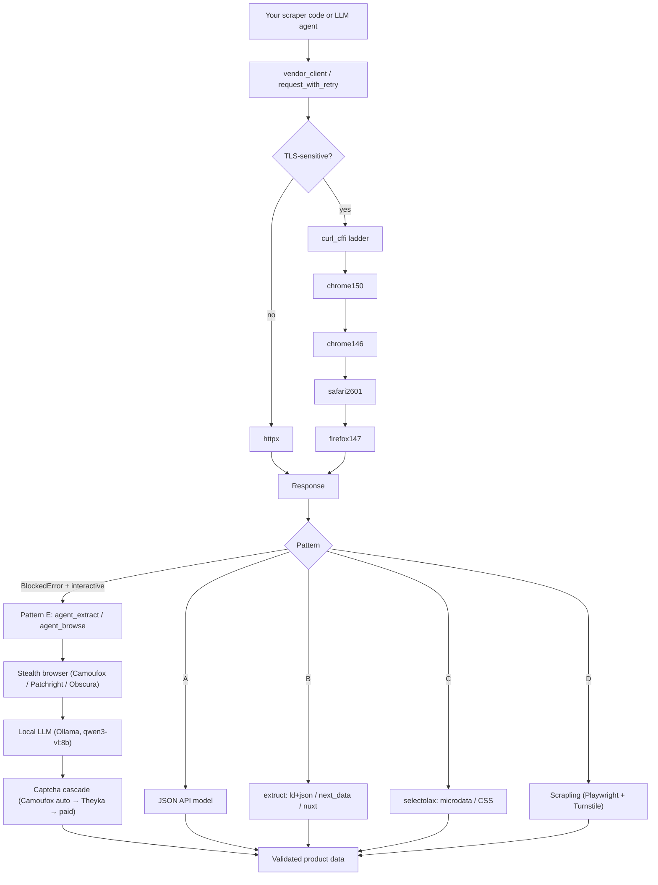

<div align="center">

# scrapper-tool

**A reusable Python web-scraping toolkit — production-grade primitives, anti-bot ladder, fixture-replay testing.**

Built from the scraping core behind [PartsPilot](https://github.com/ValeroK/affiliate-service), extracted as an open-source library so other projects (and LLM agents) can pick up the same patterns without redoing the reverse-engineering work.

<br />

[](https://github.com/ValeroK/scrapper-tool/actions/workflows/ci.yml)
[](https://pypi.org/project/scrapper-tool/)
[](https://pypi.org/project/scrapper-tool/)
[](https://pypi.org/project/scrapper-tool/)
[](LICENSE)
[](https://github.com/astral-sh/ruff)
[](https://mypy-lang.org/)
[](CONTRIBUTING.md)
[](https://github.com/ValeroK/scrapper-tool/stargazers)
[](https://github.com/ValeroK/scrapper-tool/network/members)

[**Quickstart**](docs/quickstart.md) · [**All docs**](docs/index.md) · [**Settings**](docs/SETTINGS.md) · [**MCP**](docs/mcp.md) · [**Docker**](docs/docker.md) · [**Changelog**](CHANGELOG.md)

</div>

---

> **Status (2026-08-15):** stable (`v2.2.0`). The public Python API and MCP tool surface are SemVer-stable.
>
> **`v2.2.0`** is the first release validated against real, hostile sites rather than fixtures — 2.1.0 was built in a container with no egress, so none of its anti-bot code had ever met a live host. That run found and fixed bugs in both directions of the wall/content classifier, and added a five-tier captcha cascade (three of them free) plus clearance-cookie reuse. Every number in the docs is measured, including the ones that did not work. See [`docs/TESTING.md`](docs/TESTING.md) and the [changelog](CHANGELOG.md).

## What it does

Web scraping is mostly the same work every time: pick the extraction method the
site actually needs, survive the TLS fingerprint, retry sanely, and write tests
that do not break the moment the vendor ships CSS. `scrapper-tool` packages the
parts that do not change per vendor.

One call does the escalation for you — cheapest method first, climbing only when
the site forces it:

```python
from scrapper_tool import scrape

data = await scrape("https://vendor.example/product/123")
```

Behind that call: a TLS-impersonation ladder, a stealth browser, a local LLM, and
a captcha cascade — in that order, and only as far as the site makes necessary.

## Install

```bash
uv pip install "scrapper-tool[full,agent]"    # all five patterns + MCP server
camoufox fetch                                # ~300 MB, best-stealth browser
```

`pip` works too, but `[full]` needs `uv` — Scrapling and Crawl4AI pin
incompatible `lxml` ranges and only `uv` honours the override that reconciles
them. Lighter installs and the pip escape hatch: **[Install guide](docs/quickstart.md#install)**.

Check what actually works on your machine:

```bash
scrapper-tool doctor
```

It reports every tier as `ok` / `degraded` / `missing` with the exact command to
fix each one, and exits non-zero so it works as a CI or container healthcheck.

## The five patterns

Pick the one DevTools points at, or let `scrape()` choose.

| Pattern | When | Cost |
|---|---|---|
| **A** — JSON API | An XHR returns the data | Lowest |
| **B** — Embedded JSON | `ld+json`, `__NEXT_DATA__`, `__NUXT__` | Low |
| **C** — CSS / microdata | Price is in the HTML, no JSON | Medium |
| **D** — Hostile | Cloudflare Turnstile, Akamai, DataDome | High — real browser |
| **E** — LLM agent | D is still blocked, or the page needs interaction | Highest — local LLM |

Full guides: **[patterns A–E](docs/index.md#pattern-guides)**.

## Security: targets are vetted before they are fetched

Every surface checks a URL before issuing a request. Private, loopback,
link-local and cloud-metadata targets are refused, along with non-`http(s)`
schemes and hostnames that *resolve* into private space.

This is **on by default**, and it matters most if you run the REST sidecar:
without it, anything that can reach the sidecar can make it fetch
`169.254.169.254` and read your cloud credentials back.

To reach a legitimate internal target, allowlist it rather than turning the
guard off:

```bash
SCRAPPER_TOOL_URL_GUARD_ALLOW=127.0.0.1,10.0.0.0/8
```

What is covered, what is not, and the fully-closed `..._STRICT` mode:
**[Target URL guard](docs/SETTINGS.md#target-url-guard-ssrf-protection-v221)**.

## Run it as a service

| Mode | Command | Docs |
|---|---|---|
| **MCP server** (Claude, Cursor, any MCP client) | `scrapper-tool-mcp` | [docs/mcp.md](docs/mcp.md) |
| **REST sidecar** (any language, plain HTTP) | `scrapper-tool-serve` | [docs/http-sidecar.md](docs/http-sidecar.md) |
| **Docker** (all five patterns in one image) | `docker compose up` | [docs/docker.md](docs/docker.md) |

## Settings

Every knob is an env var, a constructor argument, or a per-call keyword — in that
order of precedence. **[docs/SETTINGS.md](docs/SETTINGS.md)** is the canonical
reference: if a setting is not there, it is not a public knob.
**[`.env.example`](.env.example)** is a drop-in starter with every variable annotated.

## Architecture


```mermaid
flowchart TD
    A[Your scraper code or LLM agent] --> B[vendor_client / request_with_retry]
    B --> C{TLS-sensitive?}
    C -- no --> D[httpx]
    C -- yes --> E[curl_cffi ladder]
    E --> E1[chrome150] --> E2[chrome146] --> E3[safari2601] --> E4[firefox147]
    D --> F[Response]
    E4 --> F
    F --> G{Pattern}
    G -- A --> H[JSON API model]
    G -- B --> I[extruct: ld+json / next_data / nuxt]
    G -- C --> J[selectolax: microdata / CSS]
    G -- D --> K["Scrapling (Playwright + Turnstile)"]
    G -- "BlockedError + interactive" --> M["Pattern E: agent_extract / agent_browse"]
    M --> M1["Stealth browser (Camoufox / Patchright / Obscura)"]
    M1 --> M2["Local LLM (Ollama, qwen3-vl:8b)"]
    M2 --> M3["Captcha cascade (Camoufox auto → Theyka → paid)"]
    M3 --> L[Validated product data]
    H --> L
    I --> L
    J --> L
    K --> L
```

## Documentation

| | |
|---|---|
| **[Quickstart](docs/quickstart.md)** | 5-minute on-ramp. |
| **[Settings reference](docs/SETTINGS.md)** | Every env var, default, choice list. *(v1.0.0+)* |
| **[`.env.example`](.env.example)** | Drop-in starter file with every variable annotated. |
| **[E2E test plan](docs/E2E_TEST_PLAN.md)** | Operator-runnable end-to-end suite — library / Docker / MCP modes against LM Studio. *(v1.0.0+)* |
| **[`scripts/e2e/`](scripts/e2e/)** | Runnable test scripts referenced by the E2E plan. |
| **[Recon playbook](docs/recon.md)** | DevTools-driven reverse-engineering of a new vendor site. |
| **[Pattern A — JSON API](docs/patterns/a-json-api.md)** | Vendor exposes an XHR / JSON endpoint. |
| **[Pattern B — Embedded JSON](docs/patterns/b-embedded-json.md)** | `ld+json`, `__NEXT_DATA__`, `__NUXT__`, RSC payloads. |
| **[Pattern C — CSS / microdata](docs/patterns/c-css-microdata.md)** | `itemprop="price"`, fallback selectors. |
| **[Pattern D — Hostile](docs/patterns/d-hostile.md)** | Cloudflare Turnstile, Akamai EVA. |
| **[Pattern E — LLM agent](docs/patterns/e-llm-agent.md)** | Local-LLM-driven scraping for any protected site. *(v1.0.0+)* |
| **[Anti-bot ladder reference](docs/reference/ladder.md)** | How the ladder walks, when to bump the primary profile. |
| **[Test helpers](docs/reference/testing.md)** | `FakeCurlSession`, `replay_fixture`, golden-snapshot pattern. |
| **[Agent integration](docs/agent-integration.md)** | MCP wiring for Claude, OpenClaw, Hermes Agent, AutoGen, LangChain. *(v0.2.0+)* |
| **[2026-04-30 landscape research](docs/research/2026-04-30-landscape.md)** | Why these tools, sourced. |

## Why this exists

Most scrapers are written from scratch every time, even though 90% of the work is the same: pick the right extraction pattern, survive the TLS fingerprint, retry/backoff sanely, and write tests that don't drift the moment a site updates.

`scrapper-tool` packages the parts that don't change per vendor, so you only write the parts that do.

- **Pattern-first design.** Five named, documented extraction patterns (A–E) — pick the one DevTools points at, skip the rest.
- **Anti-bot ladder built in.** Auto-walks `chrome150 → chrome146 → safari2601 → firefox147 → chrome133a` when a profile gets fingerprinted.
- **Deterministic tests.** Fixture-replay (`FakeCurlSession`, `replay_fixture`, golden snapshots) — no live HTTP in CI.
- **Optional hostile mode.** Cloudflare Turnstile / Akamai EVA defeat path via [Scrapling](https://github.com/D4Vinci/Scrapling) — opt-in extra, no Playwright bloat by default.
- **LLM-agent ready.** `v0.2.0+` ships an MCP server so Claude, AutoGen, LangChain, etc. can drive the scraper directly.
- **Local-LLM scraping for any protected site (`v1.0.0+`).** Pattern E adds Camoufox + browser-use + Crawl4AI + Ollama — zero API cost, two modes (`agent_extract` for fast 1-call extraction, `agent_browse` for interactive multi-step tasks). Humanlike-behavior layer defeats DataDome.
- **Captchas solved on the way past (`v2.2.0+`).** Five tiers, cheapest first: settle → click the checkbox → align the slider (pure geometry, **no model**) → read the image grid with a local VLM → paid solver. Measured live: reCAPTCHA v2 grids **3/4–4/5** with a ~27B VLM, GeeTest sliders **~20%** with no model at all. reCAPTCHA v3 and AWS WAF are *not* solvable — they are risk scores, not puzzles, and the docs say so.
- **Clearance cookies are kept, not thrown away (`v2.2.0+`).** A solve costs ~70 s of local inference or a paid API call; the `cf_clearance` it buys now survives to the next tier, and to the next run via a persisted browser profile.
- **Boring stack.** `httpx`, `curl_cffi`, `selectolax`, `extruct`. No managed SaaS bundled — your code, your egress.

## Roadmap

- [x] **v0.1.0** — Core HTTP client, retry/backoff, anti-bot ladder, patterns A–D, fixture-replay test helpers.
- [x] **v0.2.0** — MCP server for LLM agents; canary CLI for nightly fingerprint-health probes.
- [x] **v1.0.0** — Pattern E: local-LLM-driven scraping (Camoufox + browser-use + Crawl4AI + Ollama), captcha cascade, humanlike-behavior layer, full Docker stack. Public API + MCP tool surface stable under SemVer.
- [ ] **v1.1.0** — Pluggable rate-limit / robots.txt policies; per-vendor profile presets; `agent_session()` warm-browser pooling; broader Pattern E backends.

See [`CHANGELOG.md`](CHANGELOG.md) for landed changes and [open issues](https://github.com/ValeroK/scrapper-tool/issues) for what's in flight.

## Contributing

PRs and issues are welcome. Every PR that meaningfully changes how we scrape lands a `CHANGELOG.md` row.

- Read **[`CONTRIBUTING.md`](CONTRIBUTING.md)** for the maintenance contract.
- Read **[`CODE_OF_CONDUCT.md`](CODE_OF_CONDUCT.md)** before opening a discussion.
- Good first issues live under the [`good first issue`](https://github.com/ValeroK/scrapper-tool/labels/good%20first%20issue) label.

## Contributors

<a href="https://github.com/ValeroK/scrapper-tool/graphs/contributors">
  
</a>

Want to see your avatar here? Check [CONTRIBUTING.md](CONTRIBUTING.md) and open a PR.

## Acknowledgements

`scrapper-tool` stands on the shoulders of these projects:

- [`httpx`](https://github.com/encode/httpx) — async HTTP client
- [`curl_cffi`](https://github.com/lexiforest/curl_cffi) — TLS / JA3 impersonation
- [`selectolax`](https://github.com/rushter/selectolax) — fast HTML parsing
- [`extruct`](https://github.com/scrapinghub/extruct) — `ld+json`, microdata, RDFa extraction
- [`Scrapling`](https://github.com/D4Vinci/Scrapling) — Playwright-based hostile-site backend

## License

[MIT](LICENSE) © scrapper-tool contributors.

<div align="center">

If `scrapper-tool` saves you time, consider [starring the repo](https://github.com/ValeroK/scrapper-tool) — it helps others find it.

</div>
